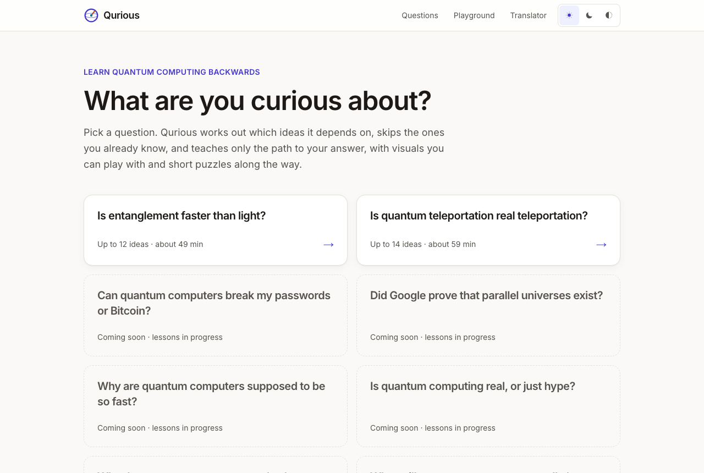
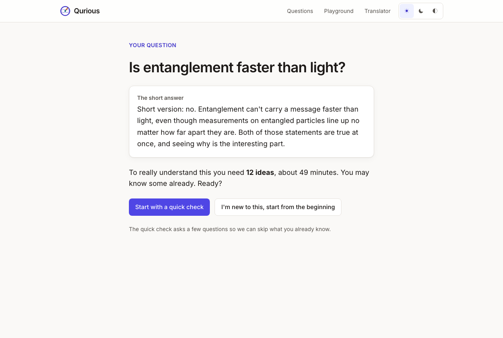
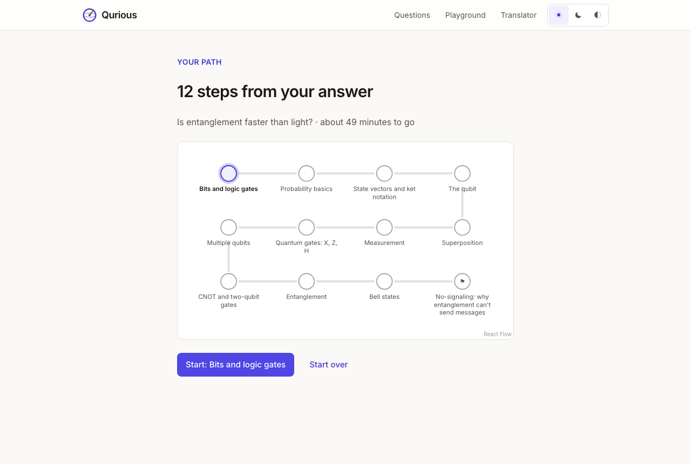
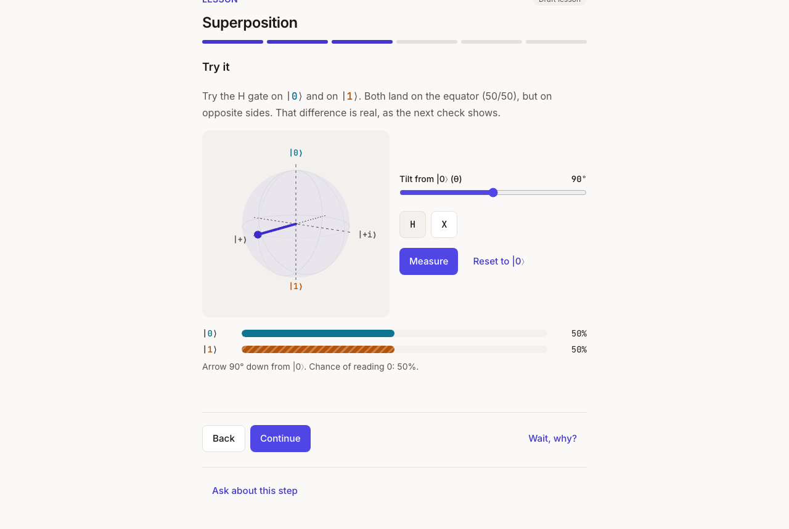
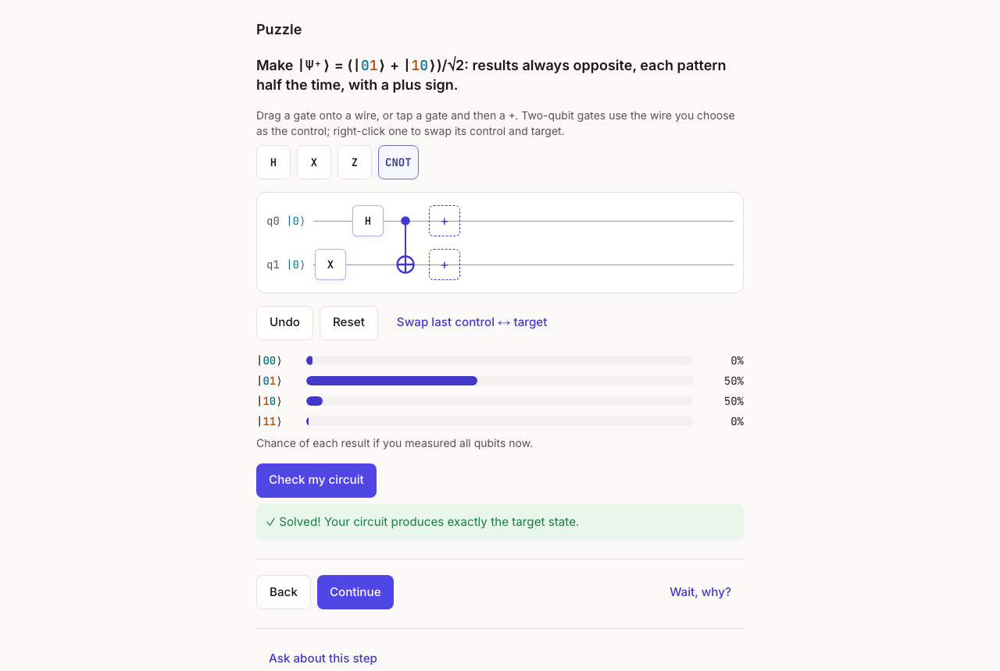
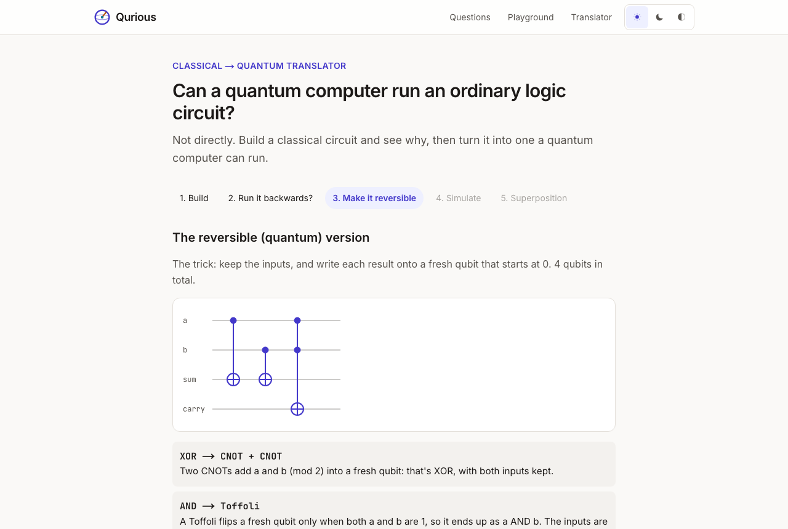
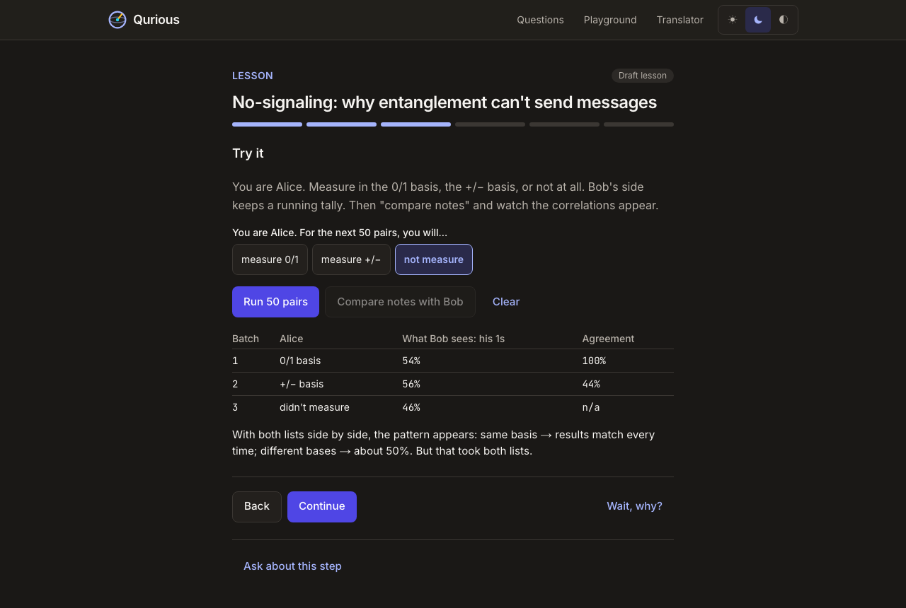

# Qurious

**Learn quantum computing by starting from the question you're curious about.**

Most quantum computing courses start with "bit vs. qubit" and build up slowly, and many learners give up before reaching anything interesting. Qurious works the other way around. You pick a question, such as *"Is entanglement faster than light?"* Qurious works out which ideas that question depends on, runs a quick check to skip the ones you already know, and teaches only the path to your answer. Each step leads with something you can play with, then a puzzle and a check.

Qurious is a **tutor, not a chatbot**. What gets taught comes from a reviewed concept map and hand-written lessons. The language model only personalizes the framing and answers follow-ups from those lessons, and it says so honestly when something isn't covered.



| | |
| --- | --- |
|  |  |
|  |  |
|  |  |

## What's inside

- **Two complete journeys**, from question card to hands-on reward: *Is entanglement faster than light?* (try to signal through entangled pairs) and *Is quantum teleportation real teleportation?* (teleport a qubit you prepared). Six more questions are mapped and marked "coming soon".
- **A concept map of 31 ideas**: 15 with full lessons (all `draft` until reviewed), 16 in the map as stubs. See [`docs/concept_map.md`](docs/concept_map.md).
- **Lesson player**, one idea per screen: hook, analogy plus where the analogy breaks, an interactive, optional layered math (KaTeX), a puzzle, and checks with an alternate explanation on a wrong answer. A "wait, why?" button takes a detour to a prerequisite and back.
- **Interactives**: a 3D Bloch sphere, a drag-and-drop circuit builder (with a tap-to-place keyboard alternative), a measurement lab, a Bell lab, a cloning attempt and teleportation, all running on Qurious's own **TypeScript state-vector simulator** (up to 5 qubits, cross-checked against Qiskit-Aer).
- **Classical → Quantum Translator**: build AND/OR/XOR/NOT/half-adder circuits, see why they can't run backwards, convert them to Toffoli and CNOT gates, and check the simulation against the truth table.
- **Tutor layer**: follow-up questions answered only from retrieved lesson content (local embeddings + ChromaDB), hook personalization, and a v2 free-text router behind a feature flag. Groq is the primary LLM with Gemini as fallback, with backoff and caching, and it all works without any API key.
- **Study mode** (off by default): consent, pre/post-test, learning-event logging with drop-off capture, withdrawal, and CSV export, using pseudonymous research ids only.
- **Playground** with an optional **run-on-real-IBM-hardware** button and a queue-status view.
- Light and dark themes, WCAG AA contrast (axe-audited), and it works on phones.

## Repository layout

```
Qurious/
├── web/         Next.js 16 (App Router) + TypeScript + Tailwind: the learner-facing app
│   ├── src/lib/quantum/   the state-vector simulator
│   └── e2e/               Playwright journeys, accessibility audit, screenshots
├── api/         FastAPI: content + path engine, tutor (LLM + retrieval), study data, IBM hardware
├── content/     Concept map, entry questions and study assessment, as YAML (the source of truth)
├── supabase/    Database migration (tables + row-level security)
├── scripts/     validate-content.sh, sim-crosscheck.sh
├── docs/        Decisions, design system, concept map, deploy, study and content guides
└── reference/   Private course material summary (gitignored, never committed)
```

## Running it locally

Prerequisites: **Node.js 20.9+** (22 LTS recommended) and **Python 3.12** (a conda env is used here).

```bash
# 1. Environment (every key is optional for local use)
cp .env.example .env
cp web/.env.example web/.env.local

# 2. API → http://localhost:8000
conda create -n qurious python=3.12 && conda activate qurious
cd api && pip install -e ".[dev]"
uvicorn app.main:app --reload --port 8000

# 3. Web → http://localhost:3000   (in another terminal)
cd web && npm install && npm run dev
```

The first start downloads the tutor's small embedding model (about 90 MB). Without LLM keys, the tutor answers by quoting the most relevant lesson passage. Without Supabase, study data goes to a local SQLite file and accounts are hidden.

## Checks

| What | Command |
| --- | --- |
| API lint + tests | `cd api && ruff check . && ruff format --check . && pytest` |
| Tutor quality (real model) | `cd api && pytest -m slow -o addopts=""` |
| Content validation (schema, graph, dead ends, puzzle solvability, KaTeX) | `./scripts/validate-content.sh` |
| Simulator vs. Qiskit-Aer (random circuits) | `./scripts/sim-crosscheck.sh 50` |
| Web lint, types, unit tests, build | `cd web && npm run lint && npm run typecheck && npm test && npm run build` |
| End-to-end + accessibility (desktop and phone) | `cd web && NEXT_PUBLIC_API_URL=http://localhost:8100 NEXT_PUBLIC_STUDY_MODE=true npm run build && npx playwright test` |

The same checks run in GitHub Actions (`.github/workflows/ci.yml`) on every push.

## Documentation

- [`docs/decisions.md`](docs/decisions.md): every significant choice and why.
- [`docs/design-system.md`](docs/design-system.md): colors, type, components (live at `/design`).
- [`docs/concept_map.md`](docs/concept_map.md): the 31 concepts, their prerequisites, and question targets.
- [`docs/content-guide.md`](docs/content-guide.md): how to write and review lessons.
- [`docs/study-guide.md`](docs/study-guide.md): running the learning study and exporting data.
- [`docs/deploy.md`](docs/deploy.md): deploying the web app (Vercel) and the API (Hugging Face Spaces or Render).
